# Base de datos avanzadas - MTIC
## Autor
Marcelo Daniel Franco

## Advertencia
El siguiente repositorio es solo una tarea académica, por lo tanto no es debe utilizarse como una solución para producción. El código tiene problemas de seguridad importantes como inyección SQL.

This repository is only an academic assignment, therefore it is not to be used as a production solution. The code has major security issues for example SQL injection.

## Enunciado
La tarea requerida es simular particiones de datos en un sistema de gestión de bases de datos relacionales de código abierto (ej. MySQL, PostgreSQL etc.). Implementaremos esta tarea, de partición de datos, utilizando datos de calificaciones de películas recopilados del sitio web MovieLens.

Desarrollar el programa de simulación, en el lenguaje de programación de su preferencia, y generar el conjunto de funciones que carguen los datos de entrada en una tabla relacional, particionen la tabla utilizando algún enfoque de fragmentación horizontal e inserten nuevas tuplas en la partición correcta.

## Funcionamiento del sistema
La tarea fue desarrollada en java 11 con el framework Spring Boot.

## Ejecución
Las instrucciones de como construir el objeto se encuentran en la ultima sección de este documento (**Compilación**). Sin embargo, para no requerir la instalación del sdk y tener que compilar, disponibilizo un jar compilado y listo para ejecutarse en la carpeta llamada **ejecutable**, en la misma adicional al jar se encuentran los archivos csv de ejemplo y el archivo de configuración para la conexión de la base de datos.

### Pasos
- Clonar repositorio
```console
git clone https://github.com/marcelodf12/mtic-dba-tarea1.git
```
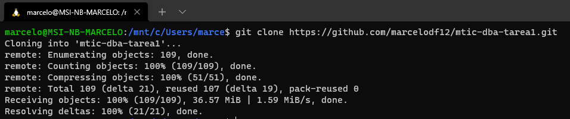

- Ingresar a la carpeta 
```console
cd mtic-dba-tarea1/
cd ejecutable/
```
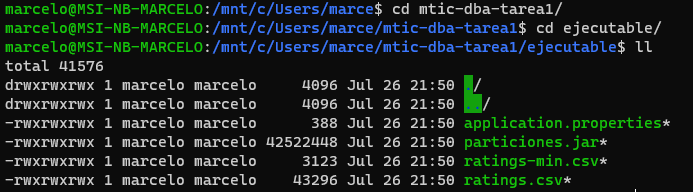

- Editar el archivo application.properties y setear los valores de la base de datos MYSQL.
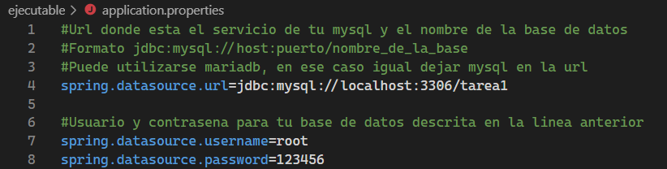

- Ejecutar el jar (esto iniciará un servidor ligero tomcat java)
```console
java -jar particiones.jar
```
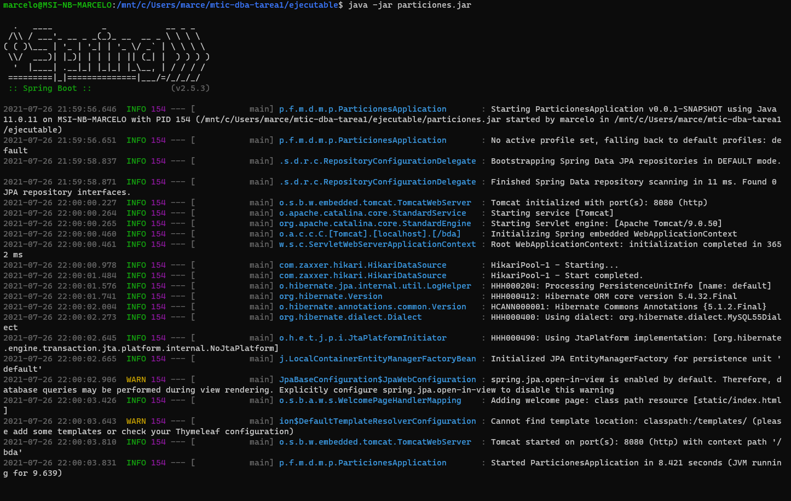

- Una vez iniciado el servidor puede ingresar a la dirección [http://localhost:8080/bda/](http://localhost:8080/bda/) desde un navegador web.
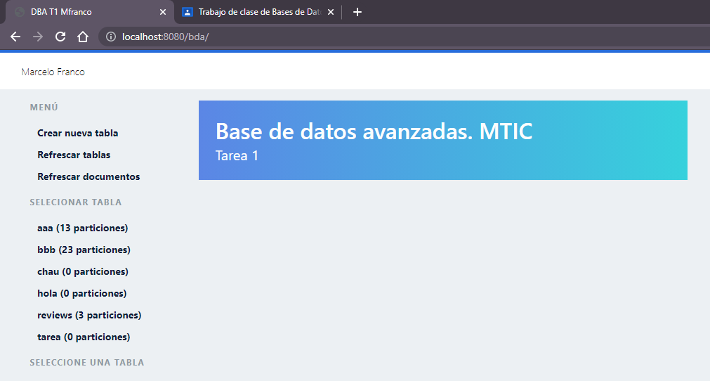

- Desde aquí puede ejecutar todas las tareas, la primera vez que ingrese deberá crear al menos una tabla desde el menú “Crear nueva tabla”.

- Los archivos csv (para cargar a la base) deben estar en el mismo directorio donde se ejecuta el jar. En el directorio ejecutable se proveen 2 archivos de ejemplo (ratings.csv y ratings-min.csv con 2000 y 150 registros respectivamente).

- El formato del archivo debe ser el siguiente
```
userId,movieId,rating,timestamp
1,1,4.0,964982703
1,3,4.0,964981247
1,6,4.0,964982224
```

- El log del servidor le indicará como ayuda la ruta donde se deben encontrar los csv.
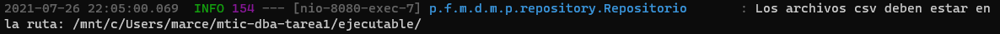
 
- Para poder ver los archivos en la interface debe seleccionar con que tabla va a trabajar dando click en el menú, esto habilitará las acciones disponibles para la tabla en el menú.
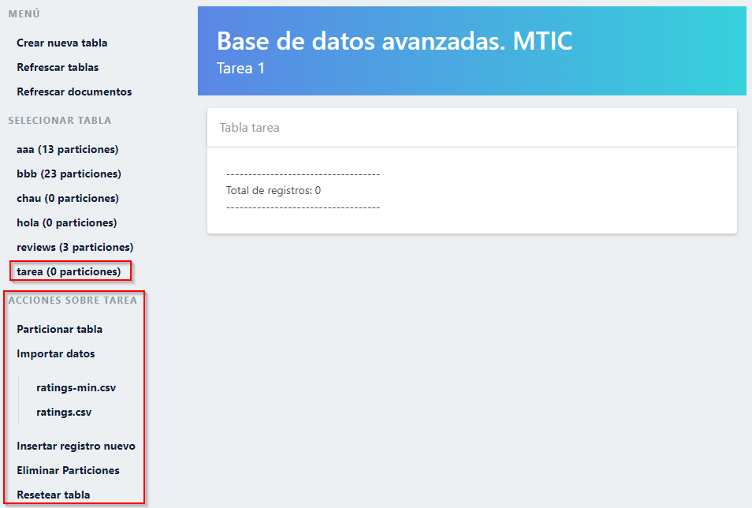

## Funcionamiento interno del sistema
El sistema utiliza el framework Spring Boot de Java y se conecta a la base de datos mediante Hibernate, aunque el 100% de las consultas se realizan como consultas nativas (createNativeQuery) ya que solo de esta forma se pueden ejecutar consultas DDL. 
La definición de las tablas creadas tiene la siguiente estructura:

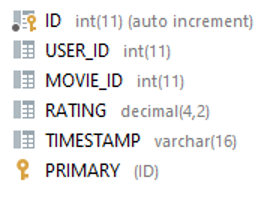

La simulación de la partición horizontal se realiza creando N sub-tablas de partición:

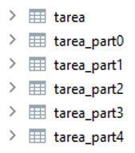
 
Además, se utiliza una tabla adicional PARTITION_INFO que almacena la información de las particiones creadas (Esta es creada automáticamente si no existe):

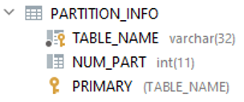
  
En la columna TABLE_NAME se almacena el nombre de la tabla y en la columna NUM_PART se almacena el número de particiones, en caso de que la tabla aún no esté particionada esta columna tendrá el valor null.

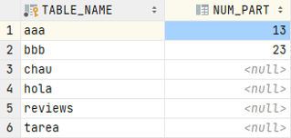

El mecanismo de balanceo entre las particiones se realiza mediante el módulo de la columna ID, esté módulo indica a que partición debe ir, como la columna ID es autonumérica usando el módulo se simula un Round Robin.
Una consideración importante, solo las tablas que se encuentren registradas en PARTITION_INFO serán visualizadas en el sistema, cualquier tabla que se encuentra en la base de datos, pero no registrada en esta tabla, será ignorada. Al tratarse de una simulación la modificación manual de esta tabla puede llevar a inconsistencias y el mal funcionamiento del sistema.

### Clases implementadas
#### RestServices.java
[RestServices.java](./src/main/java/py/fpuna/mtic/dba/mfranco/particiones/rest/RestServices.java) es la clase que implementa los servicios rest que consume el front

#### Repositorio.java
[Repositorio.java](./src/main/java/py/fpuna/mtic/dba/mfranco/particiones/repository/Repositorio.java) es la clase que implementa la lógica del sistema, aquí se encuentran todos los SQL utilizados

#### Frontend
El frontend es un simple html ([index.html](./src/main/resources/static/index.html)) con unos script en vanilla javascript ([scripts.js](./src/main/resources/static/scripts.js)) que llama a los servicios rest

## Compilación
### Ejecutar en modo desarrollo
mvn spring-boot:run

### Empaquetar
mvn clean install
El comando genera una archivo jar en la carpeta target de nombre particiones-version.jar

### Ejecutar jar
java -jar particiones-0.0.1-SNAPSHOT.jar 